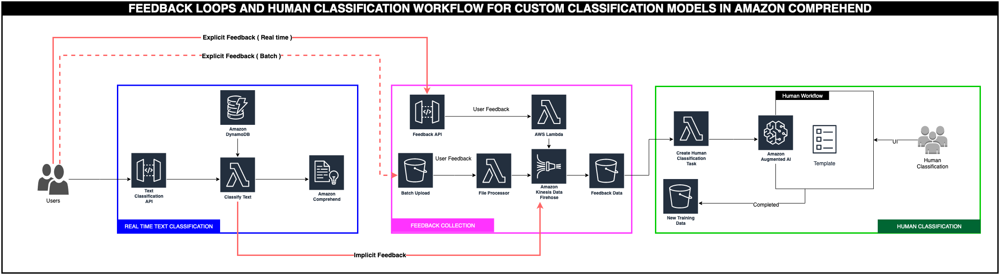

## Active learning workflow for Amazon Comprehend Custom Classification models with Amazon Augmented AI
Amazon Comprehend  Custom Classification API enables you to easily build custom text classification models using your business-specific labels without learning ML. For example, your customer support organization can use Custom Classification to automatically categorize inbound requests by problem type based on how the customer has described the issue.  You can use custom classifiers to automatically label support emails with appropriate issue types, routing customer phone calls to the right agents, and categorizing social media posts into user segments.

For custom classification, you start by creating a training job with a ground truth dataset comprising a collection of text and corresponding category labels. Upon completing the job, you have a classifier that can classify any new text into one or more named categories. When the custom classification model classifies a new unlabeled text document, it predicts what it has learned from the training data. Sometimes you may not have a training dataset with various language patterns, or once you deploy the model, you start seeing completely new data patterns. In these cases, the model may not be able to classify these new data patterns accurately. How can we ensure continuous model training to keep it up to date with new data and patterns?

In this two part blog series, we discuss an architecture pattern that allows you to build an active learning workflow for Amazon Comprehend custom classification models. The first post will describe a workflow comprising real-time classification, feedback pipelines and human review workflows using Amazon Augmented AI (Amazon A2I). The second post will cover the automated model building using the human reviewed data, selecting the best model, and automated deployment of an endpoint of the chosen model.

Feedback loops play a pivotal role in keeping the models up to date. This feedback helps the models learn about their misclassifications and learn the right ones. This process of teaching the models continuously through feedback and deploying them is called active learning.

For every prediction Amazon Comprehend Custom Classification makes, it also gives a confidence score associated with its prediction. This architecture proposes that you set an acceptable threshold and only accept the predictions with a confidence score that exceeds the threshold. All the predictions that have a confidence score less than the desired threshold are flagged for human review. The human decides whether to accept the model’s prediction or correct it.

In some instances, the model may be confident about its predictions, but the classification might be wrong. In these scenarios, the end-user applications that receive the model predictions can request explicit feedback from its users on the prediction quality. A human moderator reviews this explicit feedback and reclassifies instances where the feedback was negative. This process of generating human-verified data and using it for model retraining helps keep the models up to date, reduce data drift, and achieve higher model accuracy.

##Feedback Workflow Architecture.

In this section, we discuss an architectural pattern for implementing an end-to-end active learning workflow for custom classification models in Amazon Comprehend using Amazon A2I. The active learning workflow comprises the following components:

Real-time classification
Feedback loops
Human classification
Model building
Model selection
Model deployment
The following diagram illustrates this architecture covering the first three components. In the following sections, we walk you through each step in the workflow.

## Deploying CloudFormation Template

We will start by deploying an AWS CloudFormation template to provision the necessary AWS Identity and Access Management (IAM) role and Lambda function needed in order to interact with the Amazon S3, AWS Lambda, and Amazon Comprehend APIs.
	Region	Region Code	Launch
1	US East 
(N. Virginia)	us-east-1

#Architecture
-----------

Architecture below shows the core components. 

## Security

See [CONTRIBUTING](CONTRIBUTING.md#security-issue-notifications) for more information.

## License

This library is licensed under the MIT-0 License. See the LICENSE file.

